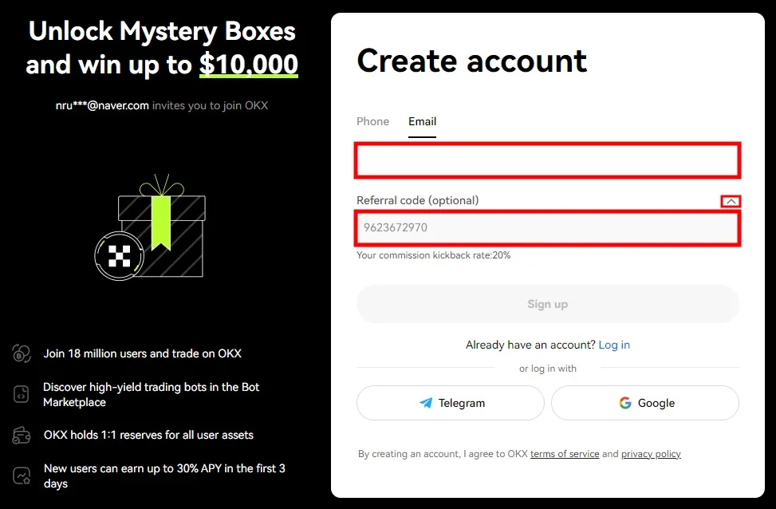
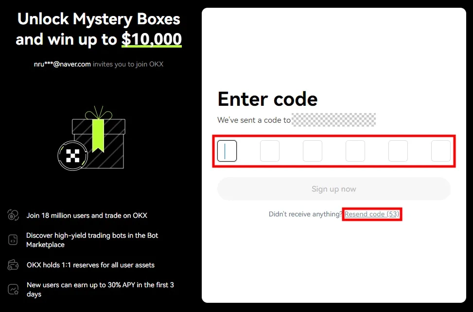
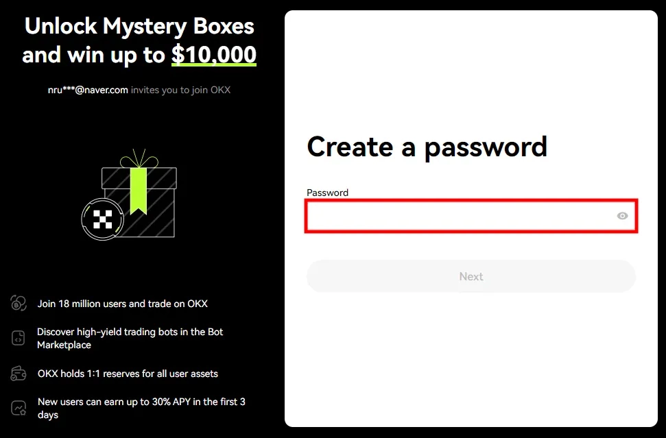
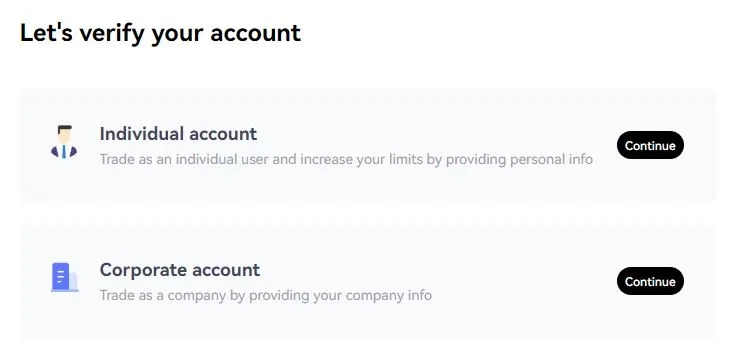
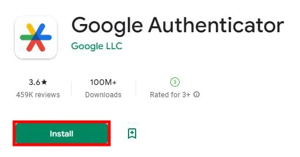
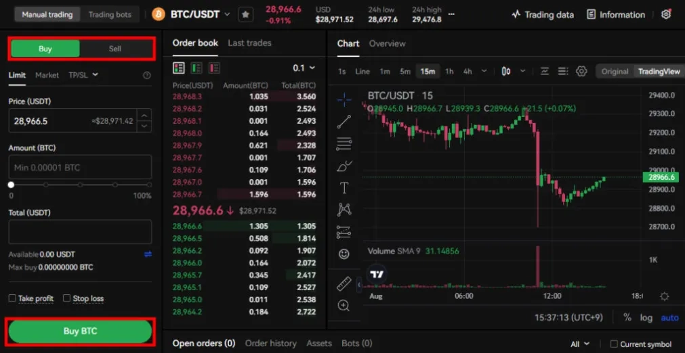
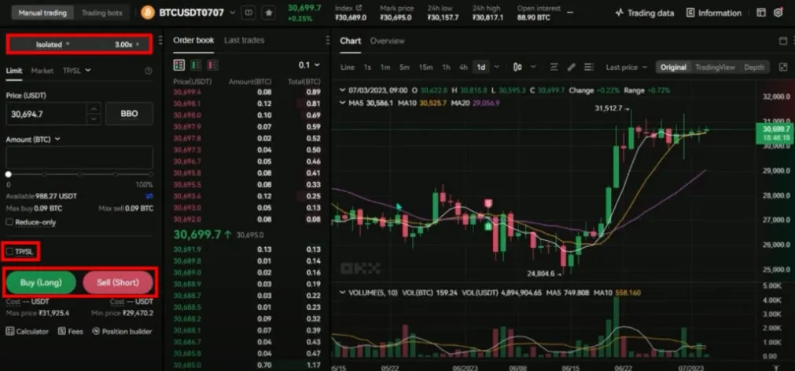
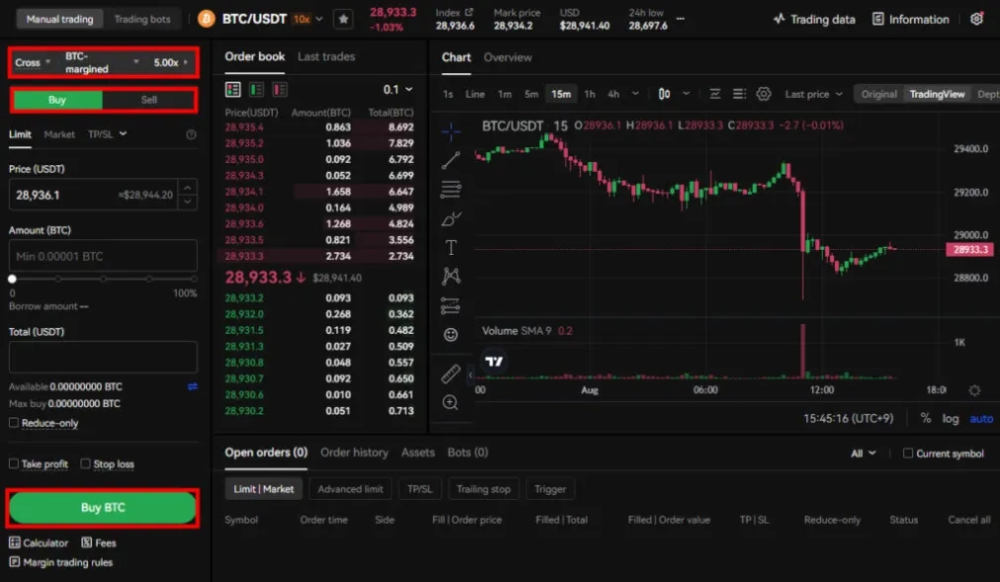
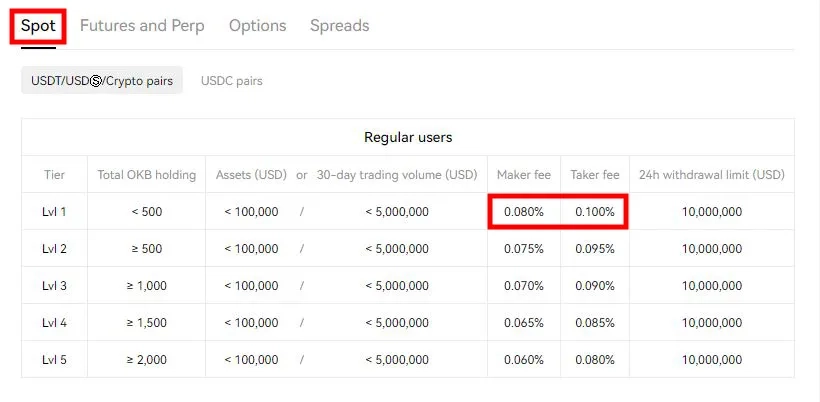
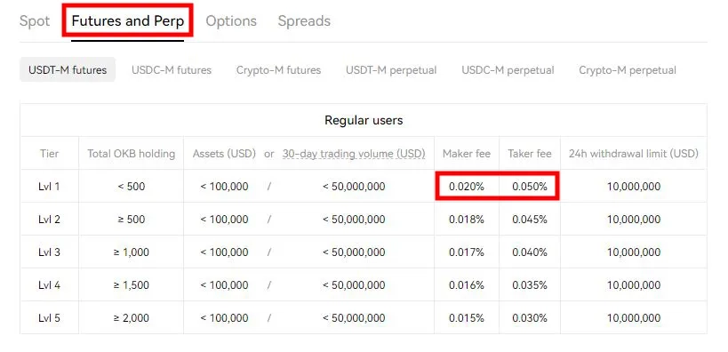

# OKX Exchange: Your Gateway to Smart Crypto Trading

Looking for a cryptocurrency exchange that combines powerful trading tools with straightforward usability? OKX stands out as the world's second-largest crypto exchange by trading volume, offering spot trading, futures, margin trading, and unique features like staking and pool mining. Whether you're buying your first Bitcoin or executing complex trading strategies, OKX delivers the functionality you need without the complexity you don't want.

---

## Getting Your OKX Account Up and Running

### The Email and Referral Setup

Head over to OKX and you'll see two options: phone or email signup. I'll walk you through email since that's what most people use. Type in your actual email—the one you check regularly—and look for the "Referral code (optional)" field. Click the arrow next to it to verify a code is already there. If it's blank, enter **47044926** to unlock commission discounts of up to 20%.

### Checking Your Inbox for the Code

A 6-digit code should hit your inbox pretty much instantly. Paste it in and move forward. Nothing in your main inbox? Check spam or click "Resend code" below the input field. The system doesn't wait around—if you take too long, you'll need a fresh code anyway.

### Creating a Password That Actually Works

After confirming your country, you'll set your password. OKX wants at least 8 characters with one uppercase letter, one number, and a special character. Skip the obvious stuff like "Password123!"—you're protecting actual money here.

## Locking Down Your Account

### Why KYC Verification Matters

KYC identity verification isn't just bureaucratic theater. It proves you're you, which becomes incredibly important if you ever need to recover your account or deal with suspicious activity. Complete it early and you won't think about it again.

### Setting Up Two-Factor Authentication

OTP through Google Authenticator adds a second lock on your account. Even if someone gets your password, they can't log in without the rotating code on your phone. 👉 [Start securing your crypto portfolio with OKX's advanced protection features](https://www.okx.com/join/47044926)

## Understanding Your Trading Options

### Spot Trading: The Straightforward Approach

Spot trading is buying crypto and hoping it goes up. You buy Bitcoin at $40,000, it climbs to $45,000, you sell. Simple math, no complications. You can only profit when prices rise, which keeps things clean for beginners.

### Futures: Betting on Market Direction

Futures let you predict whether crypto prices will climb or drop. Guess correctly and you profit. Guess wrong and you lose money. The leverage system multiplies your gains or losses by whatever magnification you choose. Liquidation kicks in automatically if losses stack up too high—the exchange closes your position before you lose more than your initial deposit.

### Margin Trading: Borrowing to Amplify Returns

Margin trading uses your existing crypto as collateral to borrow more funds. It operates similarly to futures but borrows actual coins from the spot market instead of using contracts. You're trading real assets on leverage, which means you pay interest every 24 hours on top of standard fees.

## What Trading Actually Costs You

### Deposit and Withdrawal Expenses

Depositing costs nothing. Withdrawals vary depending on which cryptocurrency you're moving and current network conditions. Check the specific coin's withdrawal fee before initiating a transfer.

### Spot Trading Fee Structure

Spot fees run 0.08% for taker orders (buying at market price) and 0.1% for maker orders (placing limit orders). These percentages drop as your trading volume increases.

### Futures Commission Breakdown

Futures start at 0.02% taker and 0.05% maker. Here's the catch: your chosen leverage multiplies these fees. 10x leverage means 10x the commission on that same trade size.

### Margin Trading Costs

Margin uses spot market rates—0.08% taker and 0.1% maker—but adds leverage multiplication and daily interest charges. Factor in both when calculating potential profits.

## Beyond Basic Trading

OKX packs in staking, pool mining, cryptocurrency lending, and an NFT marketplace alongside standard trading. The platform maintains travel rule compliance and implements security features that keep your assets protected at institutional levels.

The mobile app works on iOS and Android, giving you full trading capabilities from your phone. With over 350 cryptocurrencies available—from Bitcoin and Ethereum to Dogecoin, BNB, and Cardano—you've got plenty of options regardless of your strategy.

---

## Why OKX Works for Both New and Experienced Traders

OKX delivers extensive cryptocurrency trading options through an interface that doesn't require a PhD to navigate. The platform scales from simple spot trades to complex futures strategies without forcing unnecessary complications on beginners. 👉 [Join OKX now with referral code 47044926 for up to 20% commission discounts](https://www.okx.com/join/47044926)
